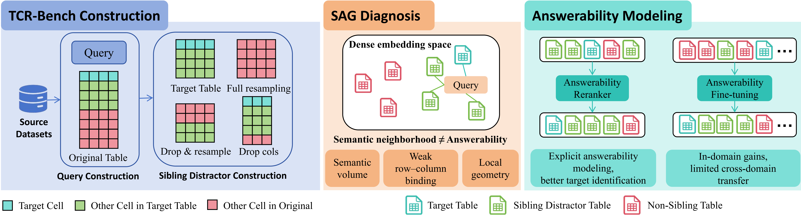

# TCR-Bench: Controlled Sibling-Table Benchmark for Diagnosing the Semantic-Answerability Gap in Table RAG

## Overview

TCR-Bench is a **controlled diagnostic benchmark** for studying the **Semantic-Answerability Gap (SAG)** in Table Retrieval-Augmented Generation (Table RAG). Semantic relevance asks whether a source matches a query in meaning, while **answerability** asks whether it contains sufficient information to answer the query. SAG arises when a retriever reaches semantically relevant sources yet fails to identify those that are **uniquely answerable**.

TCR-Bench uses tables as a controlled setting: shared schemas and entities provide strong semantic signals, while localized content and row–column bindings distinguish answerable from non-answerable sources. Its primary goal is to evaluate whether a retriever can identify **tables that truly contain the evidence required to answer a query**, rather than relying on superficial semantic similarity or topic clustering.



This figure summarizes the study: (left) TCR-Bench construction with Target Tables and Sibling Distractors; (center) SAG diagnosis in dense embedding space; (right) answerability modeling via reranking and fine-tuning.

To create a challenging retrieval setting, tables are organized into **groups derived from the same source table**. Each group contains:

* **Target Table** – the only table that fully satisfies all query constraints (answerable).
* **Sibling Distractor Tables** – hard negatives derived from the same source table with subtle modifications (semantically similar but non-answerable).
* **Non-Sibling Tables** – unrelated tables.

This design forces retrieval systems to rely on **content-level and structural understanding** rather than simple keyword or schema matching.

---

## Dataset Summary

* **Total Queries:** 209

  * 98 Exact Match (EM)
  * 55 Selective Filtering (SF)
  * 56 Selective Aggregation (SA)

* **Total Tables:** 637

### Query Types

* **EM (Exact Match)**
  Requires direct cell lookup. This subset serves as a **diagnostic lower bound** for retrieval performance.

* **SF (Selective Filtering)**
  Queries involving filtering conditions.

* **SA (Selective Aggregation)**
  Queries requiring aggregation over filtered results.

### Table Formats

Tables are rendered in different formats to test robustness:

* `markdown`
* `html`
* `csv`
* `mixed` (randomly selected from the above)

---

## Repository Structure

```
data/                     # Dataset metadata
├── TCR_Questions.json # Full Benchmark (query)
├── TCR_Questions_EM.json # The Diagnostic Subset (query)
├── TCR_Tables.json # Full Benchmark (table)
└── TCR_Tables_EM.json # The Diagnostic Subset (table)

tables/                   # Raw table files
└── TCR_8k/
    ├── <db_name>/
    │   ├── *.csv
    │   └── ...
    └── ...

tools/                    # Utility scripts
├── metrics.py            # Evaluation metrics
├── process_json.py       # JSON processing utilities
├── reformat.py           # Table format conversion
├── mklog.py              # Logging utilities
├── jina_embedding_v4.py  # Example retrieval scripts, Similar named files exist; feel free to add more

Embedding.py       # Dense retrieval implementation
AAR_CE.py          # Cross-encoder top-k reranking (AAR-CE)
AAR_LLM_PW.py      # Pointwise LLM answerability judge (AAR-LLM-PW)
AAR_LLM_LW.py      # Listwise LLM ranking (AAR-LLM-LW)
run_RAG.sh         # Example pipeline script
Compute_Metrics.py # Compute R@k, GR@k, and global DS@1
```

---

## Data Format

### Question File

`TCR_Questions.json` is a list of dictionaries:

```json
{
  "question_id": "Question_G4_Q0",
  "db_id": "college_completion",
  "highlighted_table": ["state_sector_grads_T0"],
  "all_tables_in_group": [
    "state_sector_grads_T0",
    "state_sector_grads_T1",
    "state_sector_grads_T2",
    "state_sector_grads_T3",
    "state_sector_grads_T4"
  ],
  "question": "As a data analyst, could you help me determine the highest graduation cohort among all records where the state identifier is greater than 54?",
  "answer": [19.0],
  "answer_index": [38, 44],
  "question_type": "SA"
}
```

**Field descriptions**

* `question_id` – unique identifier for the query
* `db_id` – database identifier corresponding to a folder in `tables/`
* `highlighted_table` – the Target Table that satisfies all query constraints
* `all_tables_in_group` – tables belonging to the same group (Target + distractors)
* `question` – natural language query
* `answer` – ground-truth answer
* `answer_index` – index location of the answer in the table
* `question_type` – query category (`EM`, `SF`, `SA`)

---

### Table Metadata File

Example entry from `TCR_Tables.json`:

```json
{
  "db_id": "college_completion",
  "table_path": "state_sector_grads_T0",
  "table_name": "state_sector_grads",
  "table_format": "markdown"
}
```

**Field descriptions**

* `db_id` – database identifier
* `table_path` – relative path or identifier of the table file
* `table_name` – original table name
* `table_format` – table representation format (`markdown`, `html`, `csv`, `mixed`)

---

## Quick Start

### Install Dependencies

Before running the example, install the required packages:

```bash
pip install -r requirements.txt
```

### Run the Example Pipeline

The repository provides a complete example RAG pipeline via `run_RAG.sh`. The pipeline consists of:

1. **Embedding Retrieval** – retrieve top-k tables using an embedding model.
2. **AAR-CE** – rerank with a cross-encoder that models fine-grained query–table interaction.
3. **AAR-LLM-PW** – optionally apply a large language model as a **pointwise** binary answerability judge.
4. **AAR-LLM-LW** – optionally apply a large language model for **listwise** ranking over the candidate pool.

```bash
bash run_RAG.sh
```

The script will automatically load the dataset (`TCR_Questions.json` and `TCR_Tables.json`) and table files under `tables/TCR_8k`. You can modify model paths, GPU configuration, table format, or top-k settings directly in the script.

### Notes

**Answerability-Aware Reranking (AAR)**

To address the limitation of dense retrievers in identifying the uniquely answerable table within a group, we adopt **Answerability-Aware Reranking (AAR)** as a diagnostic framework. AAR first retrieves top-k candidate tables using a dense retriever, then applies query-conditioned interaction to rerank them based on answerability.

We provide three implementations:

* **AAR-CE**: a cross-encoder reranker that scores query–table pairs with full interaction.
* **AAR-LLM-PW**: a pointwise LLM-based answerability classifier (Yes/No per candidate).
* **AAR-LLM-LW**: a listwise LLM reranker that jointly ranks all candidates in one call.

This design substantially improves fine-grained table selection compared to embedding-only retrieval, highlighting that the main bottleneck lies in coarse single-vector retrieval rather than model scale alone.

* **Embedding.py** – dense retrieval.
* **AAR_CE.py** – AAR-CE.
* **AAR_LLM_PW.py** – AAR-LLM-PW.
* **AAR_LLM_LW.py** – AAR-LLM-LW.

The pipeline reads all necessary files and saves results to `./results/`, `./results_rerank/`, `./results_rerank_LLM_PW/`, and `./results_rerank_LLM_LW/`.

**Metrics (`Compute_Metrics.py`)**

* **R@k** – whether the uniquely answerable Target appears in top-k (averaged over queries).
* **GR@k** – fraction of the sibling group covered in top-k (averaged over queries).
* **DS@1** – **global** discriminative score: `mean(R@1) / mean(GR@1)` (not the mean of per-query ratios). It measures how effectively the retriever identifies the answerable target within its semantically relevant group.

---

## Diagnostic Subset (EM)

The **Exact Match (EM)** subset is designed as a **controlled diagnostic environment**.

Since EM queries require only direct cell lookup, errors mainly reflect:

* representation failures
* retrieval mismatches

rather than reasoning limitations. This makes EM useful for analyzing how retrievers respond to structural or schema perturbations.

---

## Table Construction

Sibling distractor tables are generated from the same source tables by:

* removing columns involved in query conditions
* deleting rows violating query constraints
* resampling rows

This ensures that **exactly one table per group satisfies all query conditions**, creating strong hard negatives.

Additional perturbations include:

* schema and query paraphrasing
* varied date formats
* numeric representation changes
* scale variations

These modifications discourage shortcut learning based on keyword overlap.

---

## Example Pipeline Components

The repository provides reference implementations for:

* **Dense Retrieval**
  `Embedding.py`

* **Answerability-Aware Reranking (AAR-CE)**
  `AAR_CE.py`

* **Answerability-Aware Reranking (AAR-LLM-PW)**
  `AAR_LLM_PW.py`

* **Answerability-Aware Reranking (AAR-LLM-LW)**
  `AAR_LLM_LW.py`

These scripts can be used as starting points for building custom Table RAG systems.

---

## Main Experimental Results


We evaluate a representative set of embedding models (Qwen3-Embedding-0.6B/4B/8B, stella_en_1.5B_v5, jina-embeddings-v4, bge-m3, gte_Qwen2-7B-instruct, …) under the Mixed setting:

* **Top-1 Recall (R@1)**: highest 0.182 (Qwen3-Embedding-8B)
* **Top-k Group Recall (GR@k)**: Qwen3-Embedding-8B reaches $GR@1=0.670$, indicating strong coarse-grained group discrimination
* **Top-1 Discriminative Score (DS@1)**: generally near or below the random-selection baseline ($DS@1=0.298$ when column-deletion variants are excluded), e.g. Qwen3-Embedding-8B at $DS@1=0.271$, showing that fine-grained selection among sibling tables remains challenging

**Conclusion:** Dense retrievers perform well at distinguishing table groups (semantic neighborhood) but lack the structural understanding required for precise selection of the uniquely answerable Target among Sibling Distractors—the Semantic-Answerability Gap (SAG). Incorporating Answerability-Aware Reranking (AAR) substantially improves exact target identification, indicating that the primary bottleneck lies in first-stage dense retrieval rather than model capacity alone.

---

## License

· Code: [MIT](LICENSE)
· Dataset: [CC BY 4.0](https://creativecommons.org/licenses/by/4.0/)

---

## Additional Information

* Although moderate in scale, the benchmark is designed to be highly challenging due to dense distractors and controlled perturbations.
* The repository will be incrementally updated with additional resources, including construction artifacts, benchmark variants, and implementations based on alternative retrieval architectures such as DTR and ColBERT.
* The benchmark will be released under the CC BY-SA 4.0 license.
